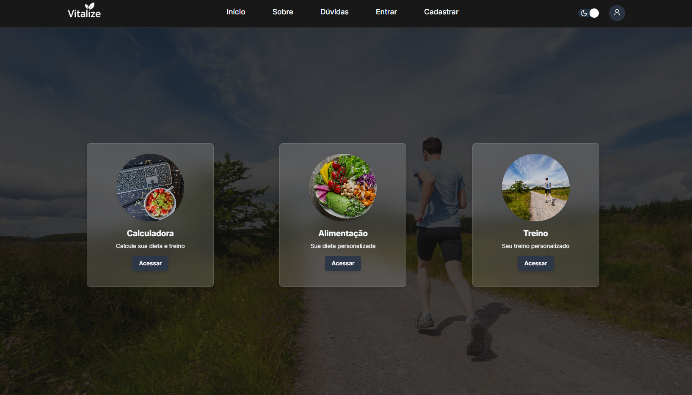
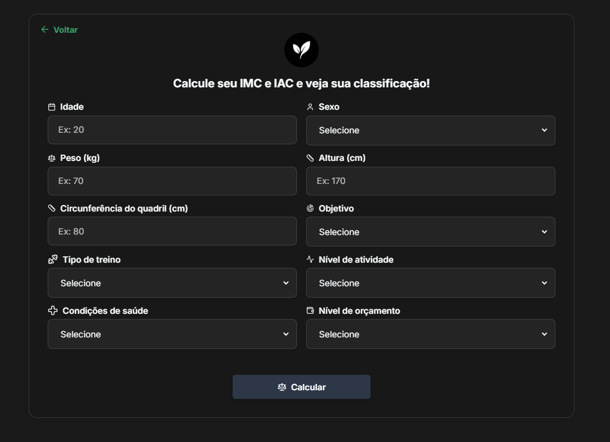
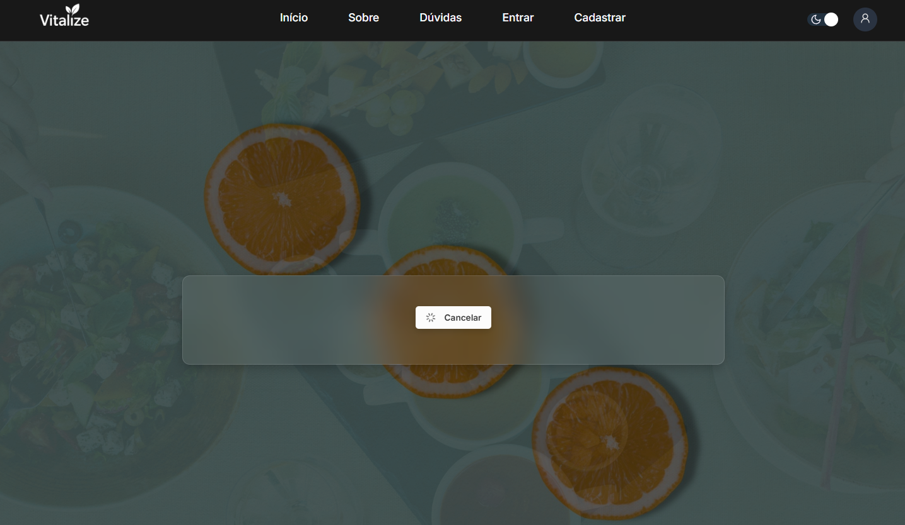
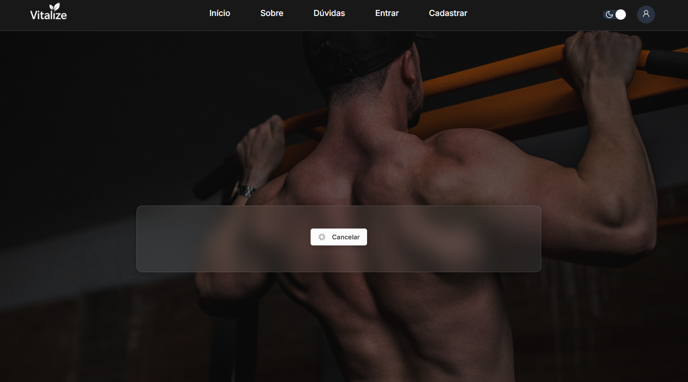
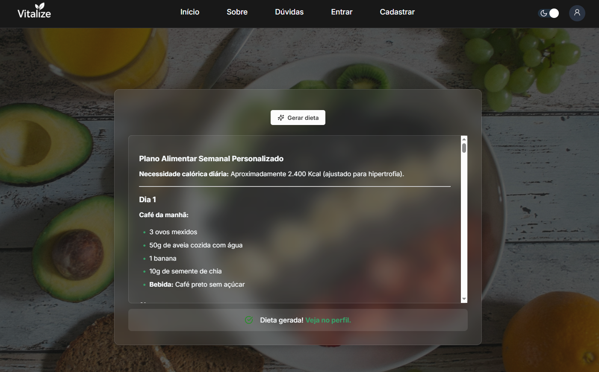
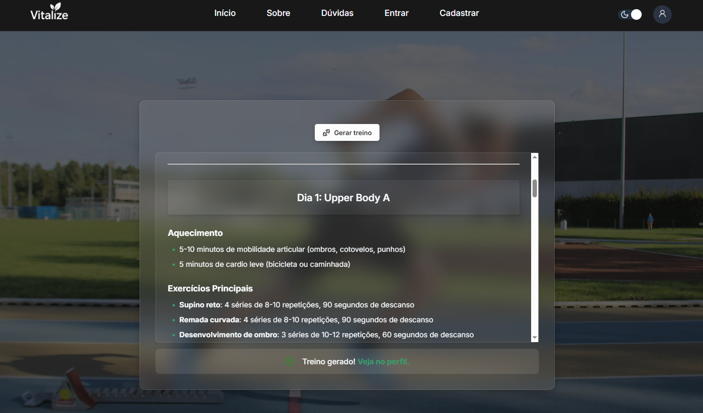
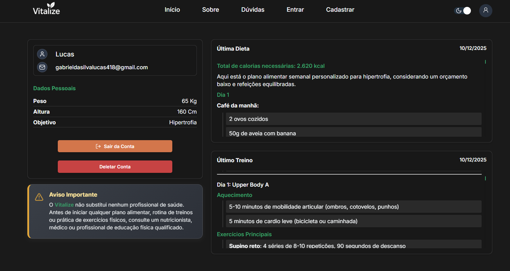

# Vitalize — Sistema Web de Nutrição e Educação Física

O **Vitalize** é um sistema web desenvolvido para auxiliar profissionais e alunos das áreas de nutrição e educação física na criação, acompanhamento e gerenciamento de planos alimentares e treinos personalizados.

O projeto busca unir **saúde e tecnologia**, oferecendo uma plataforma moderna, responsiva e intuitiva.

---

## Funcionalidades Principais

- Cadastro e autenticação de usuários  
- Criação automática de planos alimentares e treinos com base em dados e preferências  
- Armazenamento e fácil acesso aos planos criados  
- Interface responsiva e intuitiva  

---

## Prévia do Projeto

Abaixo estão algumas telas reais do sistema em funcionamento.

### Tela inicial  
Página principal do sistema, com acesso às principais funcionalidades.  

### Calculadora  
A **calculadora inteligente** coleta os dados e preferências do usuário como (idade, peso, altura, objetivo e nível de atividade) e é responsável por **gerar automaticamente planos personalizados de dieta e treino**, adaptados às necessidades individuais.  

### Gerando o plano de dieta  
Exibe a criação detalhada da dieta personalizada, baseada nas informações processadas pela calculadora.  

### Gerando o plano de treino  
Criação automática de treinos personalizados conforme o perfil e objetivos definidos pelo usuário.  

### Resultado do plano da dieta  
Exibição completa do plano alimentar gerado automaticamente.

### Resultado do plano de treino  
Visualização detalhada dos exercícios e estrutura do treino gerado.

### Perfil do usuário  
Área pessoal que armazena e exibe as dietas e treinos gerados, permitindo consulta e acompanhamento contínuo. 

